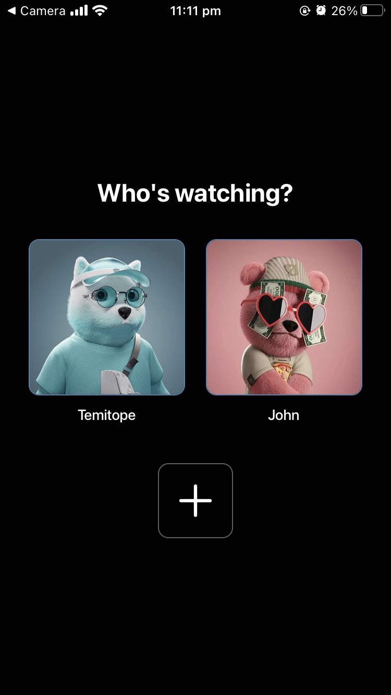
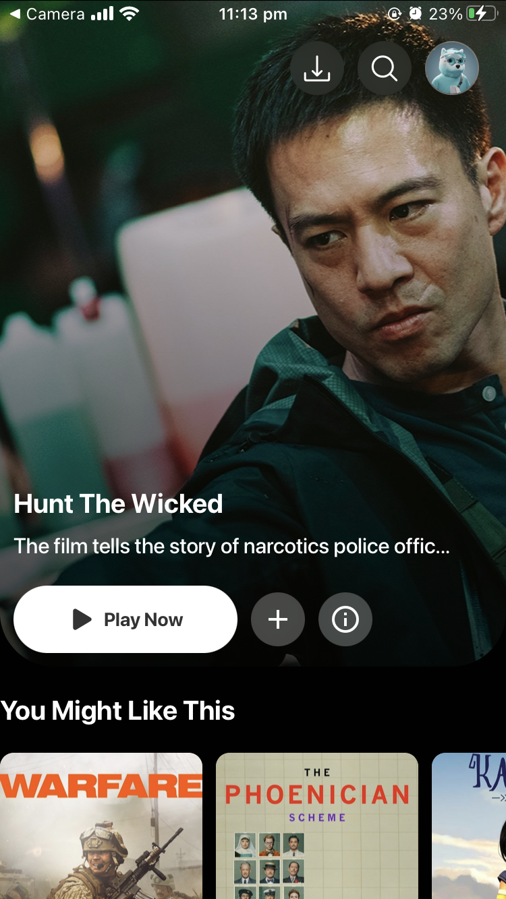

# 🎬 Movie Explorer App — Built with React Native + Expo

A high-performance, modern mobile application for discovering movies and TV shows. Powered by the TMDb API, **Movie Explorer** helps users browse popular, trending, and genre-based content — including trailers, ratings, similar recommendations, and more.

Built for mobile with smooth animations, local caching, offline fallback, and real-time API integration — this project showcases advanced **React Native (Expo)** skills, UI/UX polish, and production-ready architecture using **Expo Router**.

---

## 📱 Live Preview

> 🔗 **[Try it on Expo](https://expo.dev/preview/update?message=weather+app+first+release&updateRuntimeVersion=1.0.0&createdAt=2025-07-08T18%3A43%3A15.338Z&slug=exp&projectId=65a6a591-1aec-4aec-8f3d-a924e42aa3d2&group=5c2bbcef-2772-4128-b0ca-b41661a959e0)** - Scan QR code with Expo Go app

---

## ✨ Features at a Glance

- 🎥 **Dynamic Hero Banner** — Shows a random featured movie on every launch
- 🔄 **Dynamic Category Browsing** — Randomized content per category every time
- 📚 **Smart Categories** — You Might Like, Trending Now, Action, Anime, Comedy, Horror, and Blockbusters
- 🔍 **Movie Detail Screen** — Title, description, release year, ratings, and YouTube trailer
- 🎬 **Similar Movies Carousel** — Suggested titles based on current selection
- 🖼 **Optimized Image Caching** — Blazing fast, with fallback support if offline
- ⚡ **Animated Skeleton Loaders** — Smooth placeholders using `moti` while data loads
- 🔁 **Pull to Refresh** — Instant category re-randomization
- 🎯 **Production-Ready Navigation** — Using `expo-router` with dynamic route handling
- 💎 **Sleek & Polished UI** — Mobile-first design, responsive layouts, and subtle gradients

---

## 🛠 Tech Stack

| Tech | Usage |
|------|-------|
| **React Native** | Core mobile framework |
| **Expo** | Development toolkit & bundler |
| **Expo Router** | File-based navigation |
| **TMDb API** | Real-time movie/TV metadata |
| **Axios** | REST API requests |
| **Moti** | Animation and skeleton loading |
| **react-native-expo-image-cache** | Smart image caching & previews |
| **BlurView & LinearGradient** | iOS-like polish & UI depth |

---

### **User Experience**
- **Instant Loading** - Fast app startup and data fetching
- **Intuitive Gestures** - Pull-to-refresh and smooth scrolling
- **Accessibility** - Proper contrast and readable text
- **Error Prevention** - Clear error messages and recovery options

---

## 🧠 Architecture Overview

app/
├── index.js # Home screen with categories & hero banner
├── movieDetails/
│ └── [id].js # Dynamic detail page per movie
components/
├── SkeletonBox.js # Animated loading placeholders
services/
├── tmdb.js # Centralized TMDb API logic
assets/
├── images/ # Fallback & local image assets


---

## 🧪 API Logic Highlights (TMDb)

```js
// Random popular movies
getPopularMovies()

// Trending (top-rated)
getTopRatedMovies()

// Discover by genre: Action, Comedy, Horror, etc.
getMoviesByGenre(28) // Action

// Search for anime-style content
getAnimeMovies()

// Smart blockbusters based on popularity & vote count
getBlockbusterMovies()

// Movie details, trailers, similar recommendations
getMovieDetails(id), getMovieTrailerLink(id), getSimilarMovies(id)

---

### **Prerequisites**
- Node.js (v16 or higher)
- Expo CLI
- iOS Simulator or Android Emulator
- OpenWeatherMap API key

### **Installation**

1. **Clone the repository**
```bash
git clone https://github.com/listenexcellence/Disney-Clone.git
```

2. **Install dependencies**
```bash
npm install
```

3. **Set up environment variables**
```bash
# Create .env file in root directory
TMDB_API_KEY=your_openweathermap_api_key_here
```

4. **Start the development server**
```bash
npx expo start
```

5. **Run on device/simulator**
- Scan QR code with Expo Go app (mobile)
- Press 'i' for iOS simulator
- Press 'a' for Android emulator


## 🔧 **API Configuration**

### **Getting OpenWeatherMap API Key**
1. Visit [TMDB](https://www.themoviedb.org/settings/api)
2. Create free account
3. Navigate to API Keys section
4. Copy your API key
5. Add to `.env` file:

```env
TMDB_API_KEY=your_actual_api_key_here
```

> ⚠️ **Important**: Never commit your API key to version control

---

## 📄 **License**

This project is licensed under the MIT License - see the [LICENSE](LICENSE) file for details.

## 📸 **Screenshots**

| Home Screen | Weather Details | Loading State |
|-------------|----------------|---------------|
|  |  |

## 🙏 **Acknowledgments**

- **TMBD** - Weather data API
- **Expo Team** - Development platform
- **React Native Community** - Open-source libraries
- **Dribbble & Behance Designers** - UI inspiration

## 📧 **Contact**

**Excellence Jephter** - [Mail](mailto:excellence@thetrybeco.org)

**Project Link** - [https://github.com/listenexcellence/Disney-Clone](https://github.com/listenexcellence/Disney-Clone)
